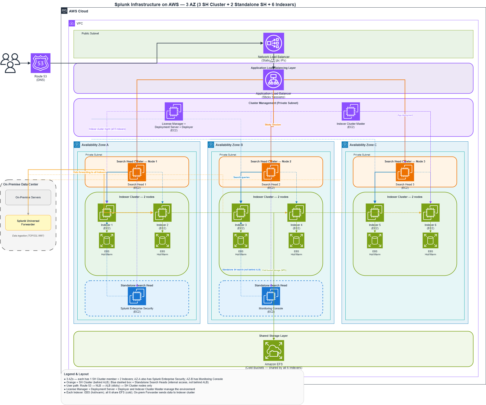

# Splunk Enterprise on AWS (Highly Available 3-AZ Deployment)

> Production-inspired Splunk Enterprise infrastructure on AWS built with **Terraform**.

## Overview

This project provisions a **highly available Splunk Enterprise environment** on AWS using Infrastructure as Code (Terraform).

The architecture follows AWS best practices by distributing resources across **three Availability Zones**, providing high availability, fault tolerance, and improved scalability.

> **Note**
>
> This repository uses **t2.micro EC2 instances** to keep AWS costs low for learning and demonstration purposes.
>
> **Splunk Enterprise is NOT supported for production workloads on t2.micro.** A production deployment should use appropriately sized compute instances (for example **c5.9xlarge** or larger), based on Splunk sizing guidelines, ingestion volume, search concurrency, and retention requirements.

---

## Architecture



The environment contains:

* 3 Availability Zones
* Search Head Cluster (3 Nodes)
* 2 Standalone Search Heads

  * Splunk Enterprise Security
  * Monitoring Console
* 6 Indexer Cluster Nodes
* Cluster Manager
* License Manager
* Deployment Server
* Deployer
* Amazon EFS for Cold Buckets
* Amazon EBS for Hot/Warm Storage
* Route53
* Network Load Balancer
* Application Load Balancer (Sticky Sessions)

---

## Architecture Flow

```text
Users
   │
Route53
   │
Network Load Balancer
(Static Elastic IP)
   │
Application Load Balancer
(Sticky Session)
   │
Search Head Cluster
   │
Indexer Cluster (6 Nodes)
   │
EBS (Hot/Warm)
   │
Amazon EFS (Cold Storage)
```

---

## AWS Services Used

| Service                   | Purpose                       |
| ------------------------- | ----------------------------- |
| EC2                       | Splunk components             |
| VPC                       | Network isolation             |
| Route53                   | DNS                           |
| Network Load Balancer     | Static public IP              |
| Application Load Balancer | User access & sticky sessions |
| EBS                       | Hot/Warm index storage        |
| EFS                       | Shared Cold Bucket storage    |
| Security Groups           | Network security              |
| IAM                       | Permissions                   |
| CloudWatch                | Monitoring                    |
| Terraform                 | Infrastructure as Code        |

---

## Splunk Components

### Search Tier

* Search Head Cluster (3 Nodes)
* Enterprise Security Search Head
* Monitoring Console

### Management Tier

* Cluster Manager
* License Manager
* Deployment Server
* Search Head Deployer

### Indexing Tier

* 6 Indexers
* Index Replication
* Cluster Management

### Storage

* Amazon EBS

  * Hot Buckets
  * Warm Buckets

* Amazon EFS

  * Cold Buckets shared across all Indexers

---

## High Availability Features

* Multi-AZ deployment
* Highly Available Search Head Cluster
* Six-node Indexer Cluster
* Sticky sessions through ALB
* Static IP exposure using NLB
* Shared Cold Storage using Amazon EFS
* Fault tolerant architecture

---


---

## Deployment

Initialize Terraform

```bash
terraform init
```

Validate

```bash
terraform validate
```

Review the execution plan

```bash
terraform plan
```

Deploy

```bash
terraform apply
```

Destroy resources

```bash
terraform destroy
```

---

## Security

The infrastructure incorporates several AWS security best practices:

* Private subnets for Splunk servers
* Public access only through the load balancers
* Security Groups with least-privilege access
* IAM Roles instead of long-term credentials
* Network isolation using Amazon VPC

---

## Learning Objectives

This project demonstrates experience with:

* Terraform
* AWS Networking
* High Availability Architecture
* Splunk Enterprise Infrastructure
* Multi-AZ Design
* Infrastructure as Code
* Load Balancing
* Storage Architecture
* Production-inspired AWS deployments

---

## Production Considerations

This repository is intentionally optimized for **learning and portfolio purposes**.

Changes recommended for a production deployment include:

* Replace **t2.micro** instances with Splunk-supported instance types such as **c5.9xlarge** (or larger according to Splunk sizing).
* Enable Auto Scaling where appropriate.
* Encrypt EBS and EFS using AWS KMS.
* Store secrets in AWS Secrets Manager or AWS Systems Manager Parameter Store.
* Enable AWS Backup.
* Use Amazon CloudWatch and AWS Config for monitoring and compliance.
* Enable VPC Flow Logs and CloudTrail.
* Implement CI/CD for Terraform deployments.
* Configure TLS certificates using AWS Certificate Manager.

---

## Cost Optimization

This project is configured for affordable lab environments.

Cost-saving decisions include:

* t2.micro EC2 instances
* Small EBS volumes
* Minimal AWS resource sizing
* Suitable for learning and demonstrations

Production environments should use appropriately sized compute and storage resources based on Splunk workload requirements.

---

## Future Improvements

* Multi-region Disaster Recovery
* S3 SmartStore
* Auto Scaling Search Heads
* AWS Backup integration
* AWS Systems Manager
* GitHub Actions CI/CD
* Terraform Modules
* Automated Splunk installation
* Splunk Observability Cloud integration

---

## Disclaimer

This repository is intended for **educational, learning, and portfolio purposes**.

Although the architecture reflects many production design principles, the default infrastructure uses **small EC2 instances (t2.micro)** to minimize AWS costs. It is **not intended for production Splunk workloads** without appropriate sizing and operational hardening.

---

## Author

**Arun Sharma**

Cloud Infrastructure | AWS | Terraform | Splunk Enterprise | Splunk Observability | Python

Feel free to fork this repository, open issues, or contribute improvements.
